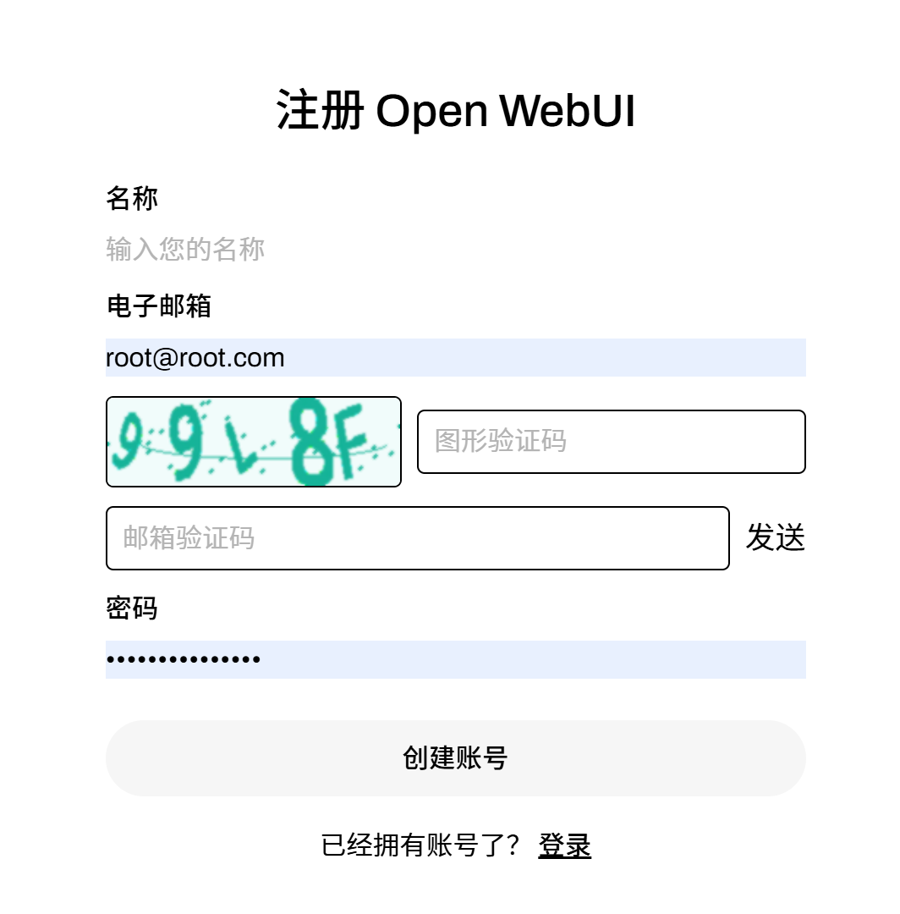

# 🛠️ Customized Open WebUI

> **免责声明 / Disclaimer**
> 本仓库是社区驱动 AI 平台 [Open WebUI](https://github.com/open-webui/open-webui) 的 **非官方分支**。
> 本项目分支于项目：https://github.com/U8F69/open-webui/，在其上面加上了用户注册的邮箱验证码逻辑。
> This project is **NOT** affiliated with or maintained by the official Open WebUI team.
> 如需迁回官方镜像，请参阅：[https://github.com/U8F69/open-webui/wiki/%E9%87%8D%E6%96%B0%E4%BD%BF%E7%94%A8%E5%AE%98%E6%96%B9%E9%95%9C%E5%83%8F](https://github.com/U8F69/open-webui/wiki/%E9%87%8D%E6%96%B0%E4%BD%BF%E7%94%A8%E5%AE%98%E6%96%B9%E9%95%9C%E5%83%8F)

---

## ✨ 新增功能 (What’s New)

| 功能         | 说明                            |
| ---------- | ----------------------------- |
| **图形验证码**  | 在注册 / 登录流程新增 CAPTCHA，抵御暴力破解   |
| **邮箱验证码**  | 支持通过 SMTP 发送一次性验证码完成注册        |

---

## 🚀 快速开始 (Docker)

```bash
# ❶ 准备 SMTP 环境变量（示例）
export SMTP_HOST=smtp.example.com
export SMTP_PORT=465
export SMTP_USER=no-reply@example.com
export SMTP_PASS="your_password"
export SMTP_USE_SSL=true      # true / false

# ❷ 运行容器
docker run -d \
  --name open-webui \
  -p 3000:3000 \
  -e SMTP_HOST=$SMTP_HOST \
  -e SMTP_PORT=$SMTP_PORT \
  -e SMTP_USER=$SMTP_USER \
  -e SMTP_PASS=$SMTP_PASS \
  -e SMTP_USE_SSL=$SMTP_USE_SSL \
  ghcr.io/yourname/open-webui:<版本号>
```

> **提示**
> 若 SMTP 服务使用 `STARTTLS`，请将 `SMTP_USE_SSL=false` 且端口通常为 **587**。

---

## 🖼️ 登录界面示例 (Screenshot)



---

## 🔧 与分支版本（https://github.com/U8F69/open-webui/）关键差异

| 功能模块        | 官方镜像 | 本分支 |
| ----------- | ---- | --- |
| CAPTCHA     | ❌    | ✅   |
| 邮箱验证码       | ❌    | ✅   |
| 计费 / 积分系统   | ✅    | ✅   |

---

## 🏷️ 品牌 / License

本项目遵守 [Open WebUI License](https://docs.openwebui.com/license) 的品牌保护条款。若需替换 LOGO、名称等，请确保符合条款 §9 并参考 [docs/BRANDING.md](./docs/BRANDING.md)。

---

Made with ❤️ by **YourName**, 2025.
